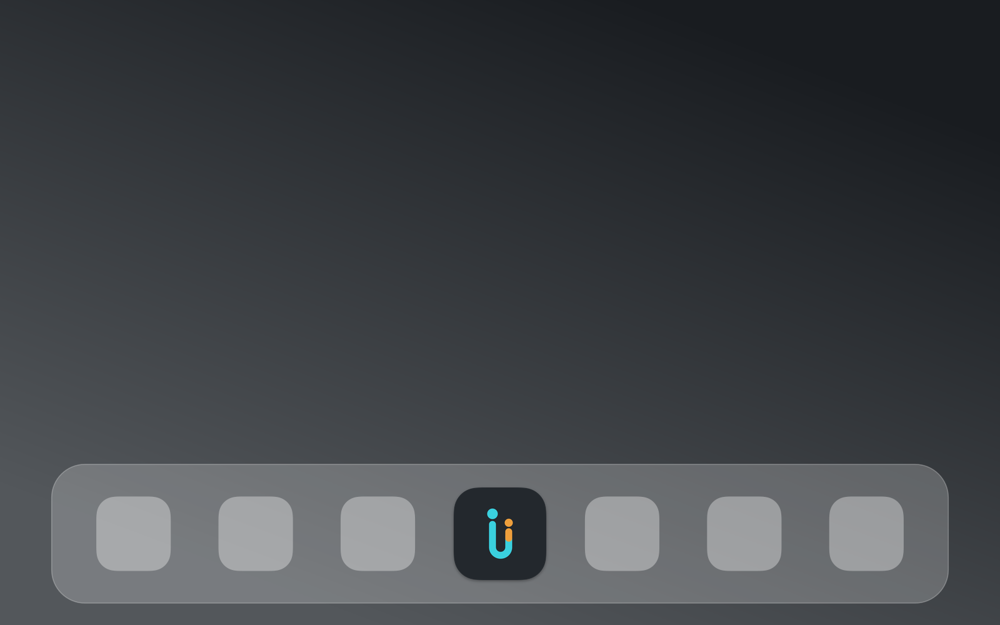

# 12 · Logo-Prozess: Zwei i, verbunden

**Datum:** 15.08.2026 · **Status: ✅ final — Logo & App-Icon fertig**

## Ausgangslage

Der Name steht (Kapitel 02: **biind**), und er liefert die Leitidee gleich mit:
Das Doppel-i ist das Logo. Zwei gleiche Zeichen — zwei Macs, zwei Welten
(Ordner ↔ Identität) — und dazwischen die Verbindung, die die App herstellt.

Vereinbarter Prozess: Jörn entwirft selbst (parallel am Mac mini), Claude
arbeitet unabhängig eigene Richtungen aus, dann wird verglichen und das Beste
aus beiden Welten kombiniert. Kein „schnell generieren" — ein echter
Design-Prozess mit Entscheidung.

## Claudes Runde 1: Drei Richtungen

Vergleichsseite (Wortmarken + App-Icon-Kacheln, jeweils Frost & Midnight):
<https://claude.ai/code/artifact/2ae4aee5-dda6-4183-918c-03202139225b>
— auch im Repo: [`docs/assets/biind-logo-richtungen.html`](../assets/biind-logo-richtungen.html)

| Richtung | Idee | Charakter |
|---|---|---|
| **A · Liaison** | die beiden i-Punkte verschmelzen zu einem Bogen | die stille — maximal reduziert, Icon menüleistentauglich |
| **B · Bindung** | i-Punkte bleiben, verbunden zur „chemischen Bindung" (Hantel) | die klarste — sofort lesbar, skaliert von 16 px bis Splashscreen, Zweifarbigkeit erzählt „zwei Macs" |
| **C · Band** | eine Banderole legt sich um beide i-Stämme | die physischste — man *sieht* das Binden; stärkstes Potenzial fürs Liquid-Glass-Icon |

Handwerkliche Entscheidung: Die Wortmarke ist **konstruiert** (Monolinie aus
Stämmen, Kreisen und Bögen als SVG-Primitive), nicht aus einer Schrift gesetzt —
so bleibt die Geste unabhängig von der späteren Font-Wahl. Farbwelt bewusst im
bestehenden Petrol/Frost/Midnight-Umfeld gehalten, leicht austauschbar.
Claudes Empfehlung: **B** als sicherster Kandidat, A als mutigste, C als
spektakulärste Option.

## Jörns Runde 1 & der Vergleich (15.08.2026, nachts)

Zwei Entwürfe von Jörn (Illustrator, siehe [`img/`](../../img/)):

1. **„Fusion"** — biind klein, Monolinie; die beiden i in Cyan, im Icon fließen
   beide Stämme unten in einen U-Bogen zusammen, die zwei verschieden großen
   Punkte schweben frei darüber.
2. **„Kacheln"** — BIND in dünnen Versalien, zwei überlappende Orange-Kacheln
   als i-Punkt bzw. Icon.

**Vergleichs-Ergebnis:** Entwurf 1 gewinnt — auch gegen alle drei
Claude-Richtungen. Begründung: Bei Liaison/Bindung/Band wird die Verbindung
*dazugelegt* (Bogen, Linie, Band); bei der Fusion ist sie **strukturell** —
die zwei i teilen sich einen Strich und werden ein Zeichen. Die zwei ungleichen
Punkte erzählen „zwei Welten" ganz ohne Konstruktion. Entwurf 2 verworfen:
verliert das Doppel-i (liest BIND), Versalien wirken korporativ, Kachel-Motiv
erzählt „App-Verwaltung" statt „binden".

**Verfeinerungspunkte für Runde 2 (Synthese):**
- Wortmarke soll können, was das Icon schon kann: *beide* i-Stämme unter der
  Baseline zum U verbinden (sonst Lesegefahr „bijnd")
- Gradient → Solid; Kontrast auf Weiß; Frost/Midnight-Varianten
- Größentest 16/32/128/1024 px (Menüleiste bis App-Icon)

## Runde 2: Die Fusion, verfeinert (15.08.2026)

Jörn hat die Synthese über Nacht selbst gebaut: beide i-Stämme laufen jetzt
durch den U-Bogen, und der Cyan/Orange-Zweiklang (aus dem verworfenen
Kachel-Entwurf gerettet!) macht die „zwei ungleichen Welten" farblich auf.
Claude hat den Entwurf als SVG rekonstruiert — mit zwei Baseline-Varianten
(deutliche Unterlänge vs. Grundlinie), nachgeschärften Farbtönen
(#21B6C8 hell / #3AD0DE dunkel / #EE9F3C) und Größentests 128 → 16 px plus
Menüleisten-Monochrom. Alles auf der Vergleichsseite (aktualisiert).

**Der wichtigste Befund der Rekonstruktion:** Liegen die beiden i-Punkte auf
ähnlicher Höhe, kippt der Cluster in die ü-Lesart — aus biind wird „bünd".
Die starke **Punkt-Diagonale** aus Jörns Original (Cyan hoch links, Orange
deutlich tiefer rechts) ist also keine Dekoration, sondern trägt die
Lesbarkeit. Sie ist ab jetzt Muss-Regel der Marke. (Gefunden, weil die erste
Rekonstruktion die Diagonale abgeflacht hatte und prompt „bünd" las —
Verifikation am gerenderten Bild, wieder einmal.)

## Finale & Icon-Produktion (15.08.2026)

Jörns Entscheidungen: **deutliche Unterlänge** (unverwechselbare Silhouette)
und die **nachgeschärften Farbtöne** (#21B6C8 hell / #3AD0DE dunkel / #EE9F3C).

Produktionsstraße:

1. **Master-SVGs** in [`design/`](../../design/): Wortmarke (hell/dunkel,
   inkl. Diagonale-Regel als Kommentar im SVG) und Icon-Artworks 1024×1024
   (Midnight + Frost)
2. **Rasterung** mit `rsvg-convert` (librsvg)
3. **macOSicons-API** (`/editor/mask`): Squircle-Maske + Schatten für beide
   Varianten, dazu die Dock-Preview — der Moment, in dem das Logo zum ersten
   Mal „echt" aussah: 
4. **AppIcon.appiconset** (alle macOS-Größen 16–1024 via `sips`) in
   `Assets.xcassets`, eine Zeile `ASSETCATALOG_COMPILER_APPICON_NAME` in der
   project.yml — **biind läuft jetzt mit eigenem Icon im Dock.**

Die Frost-Variante liegt produziert bereit (`design/icon/biind-frost-masked.png`)
— als Alternativ-Icon oder für helle Kontexte.

## Nächste Schritte

Wortmarke ins künftige GitHub-README; optional später: Liquid-Glass-`.icon`-Bundle
(Icon Composer) wie bei den Kortschak-Icons.
